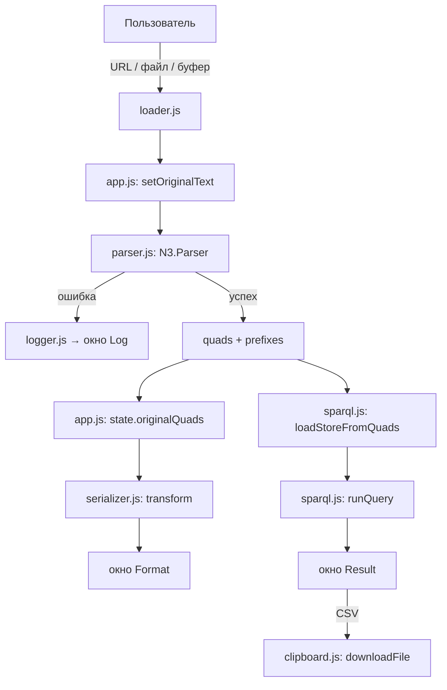
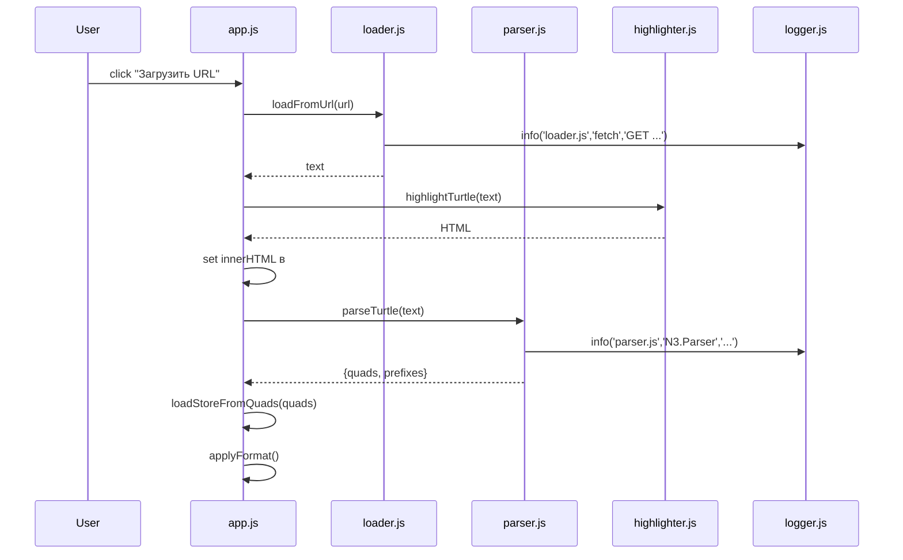
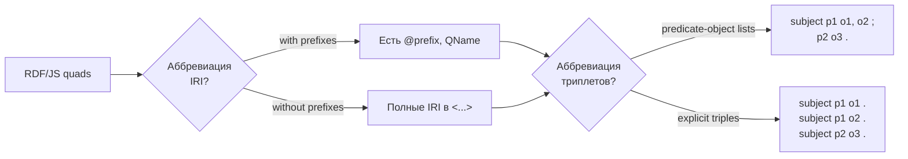
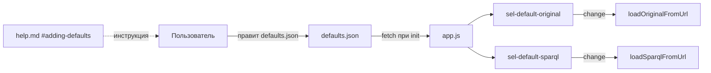

# Описание работы RDF Browser Toolkit

## Назначение

Приложение предназначено для просмотра, преобразования и SPARQL-запросов над RDF-данными
в браузере без серверной части. Реализовано на чистом JavaScript (ES-модули) и публикуется
на GitHub Pages.

## Архитектура

```
┌─────────────────────────────────────────────────────────────┐
│                         index.html                          │
│  (две пары окон: original/format, sparql/result; окно log)  │
└──────────────────────┬──────────────────────────────────────┘
                       │ ES modules
                       ▼
┌─────────────────────────────────────────────────────────────┐
│                          app.js                             │
│  оркестрация: init, события, состояние (state)              │
└──┬────────┬────────┬────────┬────────┬────────┬─────────────┘
   │        │        │        │        │        │
   ▼        ▼        ▼        ▼        ▼        ▼
 logger  loader   parser  serializer sparql  help
   │        │        │        │        │        │
   │        │        │        │        │        │
   ▼        ▼        ▼        ▼        ▼        ▼
 N3.js   fetch   N3.js   N3.js/  Oxigraph  custom
                      jsonld/  WASM      markdown
                      js-yaml              parser
```

## Поток данных



## Последовательность: загрузка и парсинг Turtle



## Четыре режима Turtle-сериализации



## Логика логирования

Каждый модуль импортирует функции `info/warn/error/debug` из `logger.js` и вызывает их
с указанием:

- уровня (`info`, `warn`, `error`, `debug`),
- имени модуля (например, `parser.js`),
- имени внешней библиотеки (например, `N3.Parser`, `oxigraph.Store`, `fetch`),
- текста сообщения.

Формат строки:

```
[2025-01-15T10:30:00.123Z] [INFO ] [parser.js] [N3.Parser] OK, распарсено 42 триплета
[2025-01-15T10:30:00.456Z] [ERROR] [parser.js] [N3.Parser] Unexpected "}" (строка 3, колонка 5)
```

## Обработка ошибок

1. **Ошибка загрузки** (сеть, CORS) → `logger.js` (error) + сообщение в окно `Original`/`SPARQL`.
2. **Ошибка парсинга Turtle** → очищаем `state.originalQuads`, оставляем текст в `Original`,
   пишем сообщение в `Log`, окно `Format` пустое.
3. **Ошибка SPARQL** → пишем сообщение в `Result` и `Log`, при этом store остаётся валидным.

## Расширяемость

- **Списки по умолчанию** хранятся в `defaults.json`, не требуют пересборки.
- **Новые форматы** добавляются как новые ветки в `serializer.js:transform()`.
- **Новые источники** (например, SPARQL-endpoint) — новый метод в `loader.js`.

## Схема расширения списка по умолчанию


