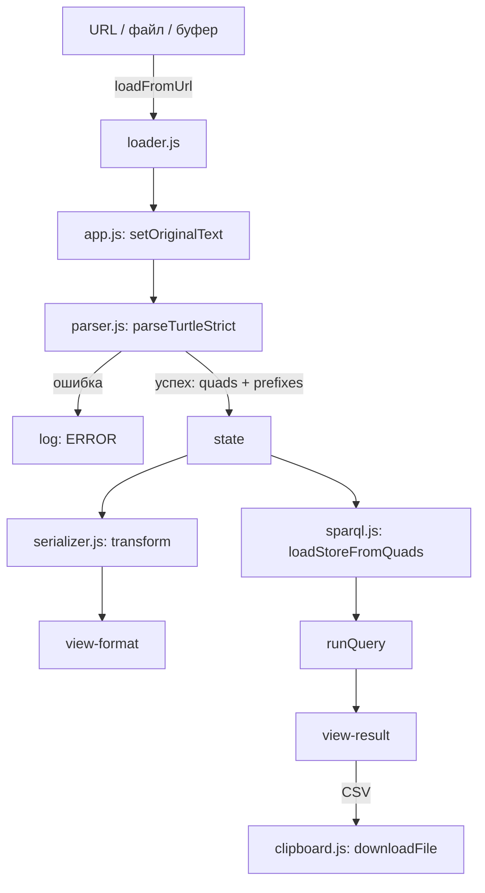
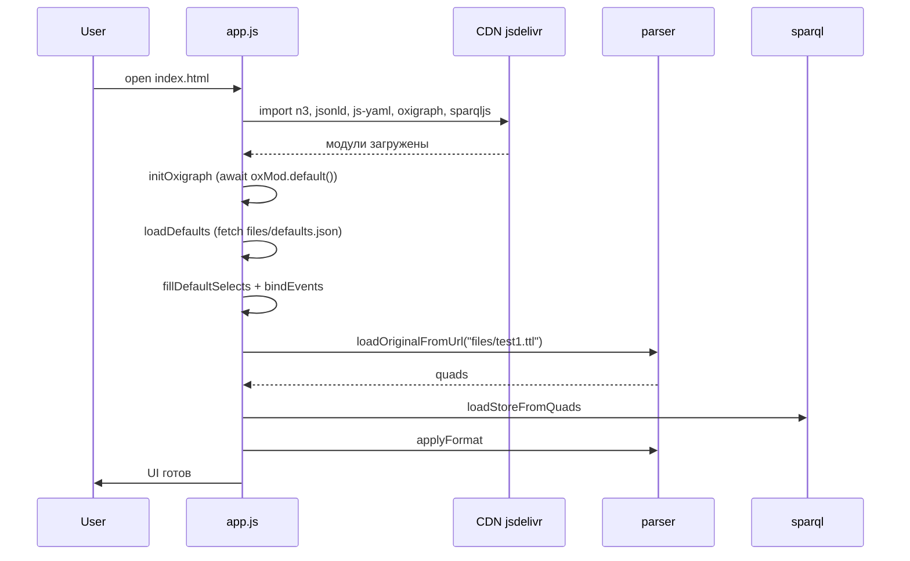

# Документация RDF Browser Toolkit

Ниже — подробное описание логики работы приложения, способов вызова внешних библиотек и подводных камней, с которыми пришлось столкнуться при разработке. Документ можно сохранить как `doc/description.md` в репозитории.

---

## 1. Общая архитектура

Приложение — **один файл `index.html`**, в котором:

- **HTML** — разметка двух рядов окон (`original|format` и `sparql|result`) плюс окно `log`;
- **CSS** — тёмная тема, поддержка вертикального ресайза рядов через `resize: vertical`;
- **JavaScript** — модуль `<script type="module">` со всем кодом.

Внешние библиотеки подключаются через **import map** — современный браузерный механизм, не требующий сборщика.

```
┌──────────────────────────────────────────────────────────┐
│                      index.html                          │
│  ┌──────────────┐  ┌──────────────┐                     │
│  │  Original    │  │   Format     │  ← верхний ряд      │
│  │  (Turtle)    │  │ (сериализатор)│                     │
│  └──────────────┘  └──────────────┘                     │
│  ┌──────────────┐  ┌──────────────┐                     │
│  │   SPARQL     │  │   Result     │  ← средний ряд      │
│  └──────────────┘  └──────────────┘                     │
│  ┌────────────────────────────────┐                     │
│  │           Log                  │  ← нижний ряд       │
│  └────────────────────────────────┘                     │
└──────────────────────────────────────────────────────────┘
```

**Логические модули** (метки в логе, физически — один файл):

| Метка | Ответственность |
|---|---|
| `app.js` | Инициализация, события, оркестрация |
| `loader.js` | Загрузка по URL, из файла, из буфера |
| `parser.js` | Парсинг Turtle (N3.js) |
| `serializer.js` | Сериализация в Turtle / N3 / N-Triples / JSON-LD / YAML-LD |
| `sparql.js` | Хранилище Oxigraph + выполнение запросов + валидация (sparqljs) |

---

## 2. Поток данных



**Последовательность при инициализации:**



---

## 3. Как вызываются внешние библиотеки

Все библиотеки берутся с **jsdelivr** — стабильного CDN с поддержкой ESM.

### 3.1. Import map

```html
<script type="importmap">
{
  "imports": {
    "n3":       "https://cdn.jsdelivr.net/npm/n3@latest/+esm",
    "jsonld":   "https://cdn.jsdelivr.net/npm/jsonld@latest/+esm",
    "js-yaml":  "https://cdn.jsdelivr.net/npm/js-yaml@latest/+esm",
    "oxigraph": "https://cdn.jsdelivr.net/npm/oxigraph@latest/web.js",
    "sparqljs": "https://cdn.jsdelivr.net/npm/sparqljs@latest/+esm"
  }
}
</script>
```

**Ключевые моменты:**

- `+esm` в URL — это специальный суффикс jsdelivr, который автоматически конвертирует CommonJS-пакет в ESM.
- Для **Oxigraph** суффикс `+esm` **не подходит**, потому что это WASM-пакет со специальной точкой входа. Нужно указывать `web.js` напрямую.
- Версия `@latest` удобна для прототипа, но для продакшена лучше зафиксировать: `@1.17.2`, `@8.3.2` и т.д.

### 3.2. Библиотека N3.js — синхронный API

**Как правильно:**

```js
import * as N3 from 'n3';

const parser = new N3.Parser({ baseIRI: 'http://example.org/' });
const quads = parser.parse(text);   // ← массив quads сразу
```

`parser.parse(text)` без callback возвращает **синхронно** массив всех quads. Это самый простой и надёжный способ.

**Как не надо:**

```js
// ❌ НЕПРАВИЛЬНО — callback может вызываться асинхронно
parser.parse(text, (err, quad, pref) => {
  if (err) throw err;
  if (quad) quads.push(quad);
});
return quads;   // ← может быть пустым!
```

В некоторых версиях N3.js callback вызывается **асинхронно** (через microtask). К моменту `return quads` массив ещё пуст. Это была **главная причина**, почему Format показывал только префиксы при первом рендере, но заполнялся после ручного переключения режима — ко второму вызову quads уже были накоплены.

### 3.3. Oxigraph — только через web.js + await init()

**Как правильно:**

```js
import initOxigraph, * as oxigraph from 'oxigraph';

await initOxigraph();              // ← обязательно!
const store = new oxigraph.Store();
store.add(quad);
```

**Как не надо:**

```js
// ❌ НЕПРАВИЛЬНО №1 — CDN esm.sh не отдаёт web.js
"oxigraph": "https://esm.sh/oxigraph@0.4.0-beta.4/web.js"
// → Failed to fetch dynamically imported module

// ❌ НЕПРАВИЛЬНО №2 — без явного init()
import * as oxigraph from 'oxigraph';
const store = new oxigraph.Store();   // падает при первом query
// → "Store не инициализирован"

// ❌ НЕПРАВИЛЬНО №3 — импорт без web.js
"oxigraph": "https://cdn.jsdelivr.net/npm/oxigraph@latest/+esm"
// → подтягивает node.js-версию, которая в браузере не работает
```

**Подводные камни Oxigraph:**

1. **CDN имеет значение.** `esm.sh` может не отдавать `web.js` для конкретной версии. `cdn.jsdelivr.net` работает стабильно.
2. **`init()` обязателен.** Oxigraph компилируется в WASM, и перед созданием `Store` нужно явно дождаться загрузки WASM-модуля. Без `await init()` любой запрос падает.
3. **`+esm` ломает пакет.** Oxigraph имеет отдельные точки входа для Node.js и браузера. Суффикс `+esm` на jsdelivr может выбрать Node.js-версию, и она не работает в браузере.
4. **Версия.** `0.4.0-beta.*` нестабильна; лучше использовать `latest` или зафиксированную стабильную (например, `0.5.x`).

### 3.4. jsonld, js-yaml, sparqljs — обычный +esm

Эти пакеты не содержат WASM и корректно конвертируются jsdelivr через `+esm`. Импорт стандартный:

```js
import jsonld from 'jsonld';
import yaml from 'js-yaml';
import sparqljs from 'sparqljs';
```

**Особенность:** у некоторых ESM-сборок `default` содержит не сам модуль, а обёртку. Поэтому в коде используется:

```js
const j = await import('jsonld');
jsonld = j.default || j;
```

### 3.5. Динамический импорт в try/catch

Все импорты обёрнуты в `try/catch`:

```js
try {
  N3 = await import('n3');
  L.app.info('N3.js загружен', 'import');
} catch (e) { L.app.error('N3.js: ' + e.message, 'import'); }
```

**Зачем:** если один CDN недоступен, приложение всё равно запускается — просто соответствующая функция не работает, а в логе видно причину.

**Как не надо:**

```js
// ❌ Статический импорт в начале модуля — если он падает,
//    весь <script type="module"> не выполняется,
//    и в логе НИЧЕГО не появляется
import * as N3 from 'n3';
import jsonld from 'jsonld';
```

Именно из-за этого первая версия показывала пустое окно лога: Oxigraph не загружался, весь модуль падал, ошибка не перехватывалась.

---

## 4. Логика работы по модулям

### 4.1. Модуль логирования

Каждый модуль имеет свой логгер:

```js
const L = {
  app:        mkLogger('app.js'),
  loader:     mkLogger('loader.js'),
  parser:     mkLogger('parser.js'),
  serializer: mkLogger('serializer.js'),
  sparql:     mkLogger('sparql.js'),
};
```

**Формат строки:**

```
[2026-09-30T19:43:06.398Z] [INFO ] [parser.js] [N3.Parser] OK: 12 триплетов
   timestamp                 level   module      library      message
```

**Почему логические метки?** Они помогают фильтровать лог глазами: видно, какая часть приложения пишет сообщение. Физически это один файл.

**Перехват ошибок** ставится в самом начале модуля — **до** любых импортов:

```js
window.addEventListener('error', e => { ... });
window.addEventListener('unhandledrejection', e => { ... });
```

Без этого любая ошибка в `import` уходила бы только в Console DevTools, а не в окно Log.

### 4.2. Модуль загрузки (`loader.js`)

**Особенность:** ссылки GitHub вида `https://github.com/user/repo/blob/main/file.ttl` не отдают CORS-заголовки. Автоматически конвертируем их в raw-URL:

```js
function toRawUrl(url) {
  const m = url.match(/^https?:\/\/github\.com\/([^/]+)\/([^/]+)\/(?:blob|raw)\/(.+)$/);
  return m ? `https://raw.githubusercontent.com/${m[1]}/${m[2]}/${m[3]}` : url;
}
```

**Три источника:**

1. `loadFromUrl(url)` — fetch по URL (с авто-превращением GitHub-ссылок).
2. `loadFromFile(file)` — FileReader для локальных файлов.
3. `readClipboard()` — `navigator.clipboard.readText()`.

### 4.3. Модуль парсинга (`parser.js`)

**Функция `parseTurtleStrict`:**

```js
function parseTurtleStrict(text, baseIRI='http://example.org/') {
  const parser = new N3.Parser({ baseIRI });
  const quads = parser.parse(text);           // синхронный API
  const prefixes = extractPrefixesFromText(text);
  return { quads, prefixes };
}
```

**Префиксы извлекаются отдельной регуляркой** — потому что `N3.Parser` возвращает их только через callback, а мы используем синхронный API.

**Регулярки для префиксов:**

```js
// Turtle: @prefix ex: <...> .
/@prefix\s+([A-Za-z_][\w-]*)?:\s*<([^>]+)>\s*\./g

// SPARQL: PREFIX ex: <...>
/PREFIX\s+([A-Za-z_][\w-]*)?:\s*<([^>]+)>/gi
```

### 4.4. Модуль сериализации (`serializer.js`)

**Четыре режима Turtle** построены на двух булевых флагах:

| Режим | `usePrefixes` | `useGrouping` |
|---|---|---|
| С префиксами, компактно | `true` | `true` |
| С префиксами, explicit | `true` | `false` |
| Полные IRI, компактно | `false` | `true` |
| Полные IRI, explicit | `false` | `false` |

**Как не надо использовать N3.Writer для Turtle:**

```js
// ❌ Может потерять триплеты для IRI с нестандартными символами
const writer = new N3.Writer({ format: 'Turtle', prefixes });
writer.addQuads(quads);
writer.end((err, result) => { ... });
```

N3.Writer пытается сокращать IRI через QName, но для IRI вроде `https://github.com/user/repo/blob/main/file.md#` (с `//`, `/`, `:`) решает, что сокращение «небезопасно», и выводит полный IRI. В некоторых случаях это приводит к непредсказуемому формату.

**Как надо:** собственный сериализатор `serializeTurtleCustom` — мы сами контролируем правила сокращения и группировки.

**JSON-LD** — через `jsonld.compact/expand/flatten`. Преобразование `quads → N-Quads → JSON-LD` обязательно, потому что `jsonld.fromRDF` работает с N-Quads-строкой.

**YAML-LD** — цепочка `quads → N-Quads → JSON-LD compact → YAML`. Отдельного браузерного YAML-LD процессора нет.

### 4.5. Модуль SPARQL (`sparql.js`)

**Инициализация** происходит **один раз** при загрузке страницы:

```js
const oxMod = await import('oxigraph');
await oxMod.default();          // ждём WASM
oxigraph = oxMod;
oxigraphReady = true;
```

**Хранилище** создаётся заново при каждой загрузке Turtle:

```js
store = new oxigraph.Store();
for (const q of quads) store.add(q);
```

**Выполнение запроса:**

```js
const result = store.query(query);
```

Oxigraph возвращает:
- **boolean** — для ASK;
- **Array of Map** — для SELECT (bindings);
- **Array of Quad** — для CONSTRUCT;
- **Iterable** — для DESCRIBE.

**Валидация SPARQL** до выполнения через `sparqljs`:

```js
const parser = new sparqljs.Parser();
const parsed = parser.parse(text);   // бросает SyntaxError при ошибке
```

Это спасает от падения Oxigraph на некорректном запросе: сначала проверяем синтаксис, потом выполняем.

---

## 5. Список «как не надо» — подводные камни

Собрано из реальных ошибок, встреченных при разработке.

### 5.1. Импорт библиотек

| ❌ Неправильно | ✅ Правильно | Почему |
|---|---|---|
| `import * as N3 from 'n3'` в начале модуля | `try { N3 = await import('n3'); } catch(e) {...}` | Если CDN недоступен — весь модуль падает, лог пуст |
| `import oxigraph from 'oxigraph'` | `import oxMod from 'oxigraph'` + `await oxMod.default()` | Без `init()` Oxigraph не работает |
| `"oxigraph": "https://esm.sh/.../web.js"` | `"oxigraph": "https://cdn.jsdelivr.net/npm/oxigraph@latest/web.js"` | esm.sh не отдаёт `web.js` |
| `"oxigraph": ".../+esm"` | `"oxigraph": ".../web.js"` | `+esm` подтягивает Node.js-версию |

### 5.2. Парсинг

| ❌ Неправильно | ✅ Правильно | Почему |
|---|---|---|
| `parser.parse(text, callback)` | `const quads = parser.parse(text)` | Callback может вызываться асинхронно — вернётся пустой массив |
| Парсить Markdown-файл как Turtle | Использовать `.ttl` | N3.Parser не понимает Markdown, вернёт 0 quads без ошибки |
| Игнорировать `quads.length === 0` | Явно логировать предупреждение | Пользователь не поймёт, почему Format пуст |

### 5.3. Логирование

| ❌ Неправильно | ✅ Правильно | Почему |
|---|---|---|
| Обработчики `window.onerror` в конце модуля | В **начале** | Иначе ошибки импорта не перехватятся |
| `console.log` без UI | Дублирование в `view-log` + Console | Пользователь не откроет F12 |
| Строки `info('app.js', ...)` | Фабрика `L.app.info(...)` | Короче, нет опечаток в имени модуля |

### 5.4. Работа с GitHub Pages

| ❌ Неправильно | ✅ Правильно | Почему |
|---|---|---|
| Ждать мгновенной публикации | Подождать 1–3 минуты | CDN GitHub обновляется с задержкой |
| Проверять по `/ver1/` | Проверять по `/ver1/index.html` | Короткий URL дольше обновляется в кэше |
| Искать ошибку в коде, если сайт 404 | Проверить `Settings → Pages` и вкладку Actions | Возможно, workflow ещё не завершён |

### 5.5. Работа с Oxigraph

| ❌ Неправильно | ✅ Правильно | Почему |
|---|---|---|
| Использовать `sparqljs` для выполнения | `sparqljs` только для валидации, `oxigraph.Store.query` — для выполнения | sparqljs не выполняет запросы |
| Полагаться на `store.query` без валидации | Сначала `validateSparql`, потом `runQuery` | Oxigraph падает на синтаксических ошибках неинформативно |
| Создавать `Store()` до `await init()` | Сначала `init()`, потом `new Store()` | WASM не готов, объект фиктивен |

### 5.6. Сериализация

| ❌ Неправильно | ✅ Правильно | Почему |
|---|---|---|
| N3.Writer для Turtle с нестандартными IRI | Свой сериализатор | Writer может терять триплеты |
| `JSON.stringify` для JSON-LD | `jsonld.compact/expand/flatten` | Без процессора JSON-LD теряет семантику |
| Отдельная YAML-LD-библиотека | Цепочка JSON-LD → js-yaml | Браузерных YAML-LD-процессоров нет |

---

## 6. Расширение приложения

### 6.1. Добавить новый RDF-файл в список «по умолчанию»

1. Положите файл в `files/my.ttl`.
2. Откройте `files/defaults.json` и добавьте запись:
   ```json
   { "label": "Мой файл", "url": "files/my.ttl" }
   ```
3. Закоммитьте. После обновления страницы запись появится в списке.

### 6.2. Добавить новый режим сериализации

1. В HTML добавьте `<option value="my-mode">...</option>` в `sel-format`.
2. В `serializer.js` добавьте `case 'my-mode': return mySerializer(quads, ...)` в `transform()`.
3. Реализуйте функцию `mySerializer`.

### 6.3. Добавить новый формат парсинга (например, JSON-LD на вход)

1. В `<input type="file">` расширьте `accept` — добавьте `.jsonld`.
2. В `setOriginalText` проверьте расширение и вызовите `jsonld.toRDF()` вместо `parseTurtleStrict`.

---

## 7. Ссылки на использованные ресурсы

**Библиотеки:**

- N3.js — <https://github.com/rdfjs/N3.js>
- JSON-LD processor — <https://github.com/digitalbazaar/jsonld.js>
- Oxigraph — <https://github.com/oxigraph/oxigraph>
- sparqljs — <https://github.com/RubenVerborgh/SPARQL.js>
- js-yaml — <https://github.com/nodeca/js-yaml>

**Спецификации:**

- Turtle 1.1 — <https://www.w3.org/TR/turtle/>
- SPARQL 1.1 Query — <https://www.w3.org/TR/sparql11-query/>
- JSON-LD 1.1 — <https://www.w3.org/TR/json-ld11/>
- YAML-LD (черновик) — <https://w3c.github.io/yaml-ld/>

**Похожие проекты:**

- rdf-play.js — <https://github.com/rubensworks/rdf-play.js>
- YASGUI — <https://github.com/TriplyDB/Yasgui>
- RDFShape — <https://github.com/weso/rdfshape>
- JSON-LD Playground — <https://json-ld.org/playground/>

---

## 8. Краткая шпаргалка

**Три правила, которые спасли проект:**

1. **Логируйте с самого начала.** Обработчики `window.onerror` — до импортов. Иначе пустой лог при любой ошибке.
2. **Не блокируйте модуль статическими импортами.** Только `await import(...)` в `try/catch`.
3. **Oxigraph — только `web.js` + `await init()`.** Без этого — «Store не инициализирован» или полный отказ загрузки.

**Три вещи, которые казались багами, но ими не были:**

1. Задержка GitHub Pages (CDN Fastly) — обновление расходится 1–3 минуты.
2. Логические метки `[parser.js]` — ярлыки, а не файлы.
3. `+esm` для Oxigraph — обёртка jsdelivr выбирает не ту точку входа, это особенность пакета.

**Куда смотреть при проблемах:**

1. **F12 → Console** — низкоуровневые ошибки (CORS, 404 CDN, WASM).
2. **Окно Log в UI** — высокоуровневые сообщения с метками модулей.
3. **Settings → Pages** + **Actions** — статус сборки GitHub Pages.
4. **Network** — какие CDN-запросы не прошли (важно при отладке импортов).
