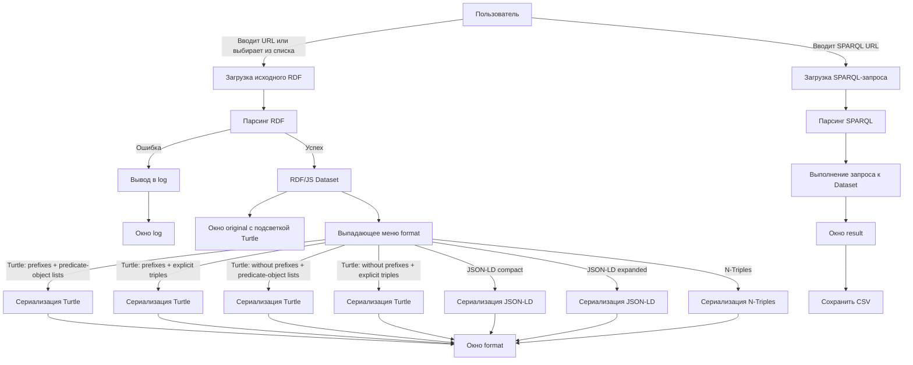
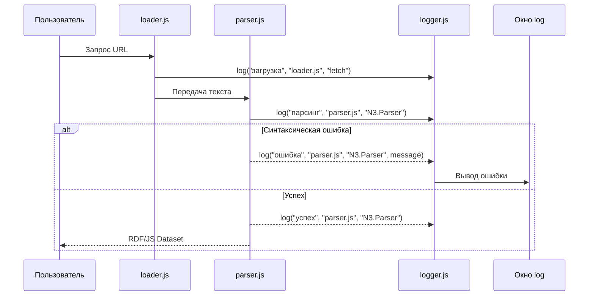
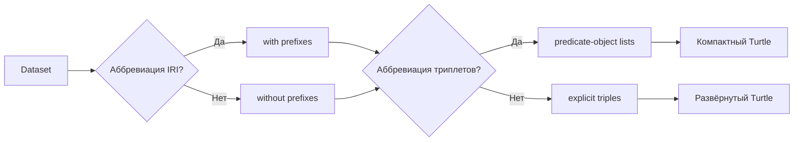

## 1
# Переписанный промпт с уточнённой терминологией

Ниже — исправленная версия вашего промпта. Ключевые терминологические правки выделены в разделе после промпта.

---

## Промпт (переписанный)

Создай браузерное JavaScript-приложение (публикация на GitHub Pages) со следующими функциями:

### 1. Два текстовых окна: `original` и `format`

**Окно `original`** отображает исходный RDF-документ в формате Turtle. Файл можно:

- загрузить по URL, введённому в поле ввода;
- выбрать из выпадающего списка «По умолчанию» (список расширяемый; кнопка **Help** содержит инструкцию по добавлению новых записей);
- текущее значение по умолчанию: `https://github.com/bpmbpm/onto/blob/main/example1/test1.md`.

При отображении файл выводится **без семантических преобразований**, но с **подсветкой синтаксиса Turtle** (highlight.js или аналог). Если при разборе возникают синтаксические ошибки, они выводятся в окно `log` (нижнее).

В окне `original` доступны кнопки: **Загрузить из буфера** и **Скопировать в буфер**.

**Окно `format`** (справа от `original`) содержит:

- кнопку **Скопировать в буфер**;
- выпадающее меню выбора преобразования.

#### Варианты преобразования для RDF Turtle

В терминологии спецификации Turtle (W3C Turtle 1.1) режимы сериализации описываются двумя независимыми параметрами:

| Параметр | Значения | Пояснение |
|---|---|---|
| **Аббревиация IRI** | `with prefixes` / `without prefixes` | Использовать ли `@prefix` и QName-сокращения (`ex:Person`) вместо полных IRI |
| **Аббревиация триплетов** | `predicate-object lists` (сокращённый) / `explicit triples` (полный) | Использовать ли `;` (predicate lists) и `,` (object lists) для группировки триплетов с общим субъектом/предикатом |

Итого четыре комбинации:

1. **С префиксами + predicate-object lists** — компактная, «человеческая» форма: `@prefix ex: <...> . ex:Alice a ex:Person ; ex:name "Alice" ; ex:knows ex:Bob .`
2. **С префиксами + explicit triples** — префиксы сохранены, но каждый триплет записан отдельно, без `;` и `,`.
3. **Без префиксов + predicate-object lists** — полные IRI, но сгруппированные триплеты.
4. **Без префиксов + explicit triples** — максимально «развёрнутая» форма.

#### Варианты для JSON-LD

Для JSON-LD аналогичные оси:

- **С контекстом (`@context`) + compact** — использование `@context`, сокращённые ключи и значения (compacted form).
- **С контекстом + expanded** — `@context` присутствует, но структура развёрнута.
- **Без контекста + expanded** — чистый expanded JSON-LD, где все ключи — полные IRI, значения — массивы объектов `{ "@value": ..., "@type": ... }`.
- **Flattened** — плоская форма с `@graph`.

#### YAML-LD

Если найдётся работоспособная JS-библиотека для YAML-LD — добавить соответствующие варианты. На текущий момент YAML-LD находится в статусе Community Group Draft; браузерных реализаций на JavaScript практически нет. В качестве fallback можно реализовать преобразование через цепочку `Turtle → RDF/JS Dataset → JSON-LD → YAML` (сериализация YAML любой библиотекой, например `js-yaml`).

#### Другие человекочитаемые формы RDF

Добавить **N-Triples** (построчный, без префиксов, максимально машинно-ориентированный, но всё же текстовый) и **N3** (если поддерживается парсером). **RDF/XML не включать** — он не является человекочитаемым.

### 2. Блок SPARQL

Правое окно (ниже или рядом с `format` — уточнить layout) отображает содержимое SPARQL-запроса. Доступны:

- загрузка по URL (поле ввода);
- выбор из списка «По умолчанию» (расширяемый);
- значение по умолчанию: `https://github.com/bpmbpm/mdld-test/blob/main/ver2/SPARQL/01-all-triples.rq`;
- кнопки **Загрузить из буфера** и **Скопировать в буфер**.

Результат выполнения запроса выводится в окно `result` (слева, под `original` или отдельно — уточнить). Кнопка **Сохранить (CSV)** сохраняет результат в CSV.

### 3. Окно `log`

Самое нижнее окно с максимально подробным выводом:

- все вызовы функций приложения с указанием модуля;
- имя внешней JS-библиотеки при каждом вызове;
- ошибки, предупреждения, информационные сообщения;
- временные метки.

### 4. Кнопка Help

Выводит содержимое отдельного markdown-файла с использованием якоря (например, `help.md#adding-defaults`). Отображается в модальном окне или отдельной панели.

### 5. Документация

В папке `doc` разместить файл с описанием работы программы и схемами алгоритмов в **Mermaid**.

---

## Что именно исправлено в терминологии

| Было | Стало | Обоснование |
|---|---|---|
| «с prefix» | `with prefixes` / аббревиация IRI | Спецификация Turtle различает *prefix declarations* и *IRI abbreviation* |
| «сокращенный режим» | `predicate-object lists` | В грамматике Turtle это `predicateObjectList` и `objectList`, а не «режим» |
| «полный режим» | `explicit triples` | Обратная операция к аббревиации триплетов |
| «без префиксов (полный IRI)» | `without prefixes` / `full IRIs` | «Полный IRI» — корректно, но лучше явно указывать отсутствие аббревиации |
| «составной триплет» | `grouped triples` / `predicate-object lists` | Термин «составной» не определён в спецификации |
| «человекочитаемые формы» | `human-readable serializations` | Устоявшийся термин в литературе по RDF |

---

## Обзор похожих программ и инструментов

| Инструмент | Что делает | Ссылка | Лицензия |
|---|---|---|---|
| **rdf-play.js** | Веб-инструмент для парсинга, сериализации и конвертации RDF (Turtle, JSON-LD, N-Triples, RDF/XML) | [github.com/rubensworks/rdf-play.js](https://github.com/rubensworks/rdf-play.js) | MIT |
| **LDTR** | Преобразование RDF-представлений в JSON-LD-совместимую структуру | [cdn.jsdelivr.net](https://cdn.jsdelivr.net) | — |
| **Ontosphere** | Браузерный редактор RDF/онтологий: загрузка из файлов/URL/SPARQL-эндпоинтов, OWL-RL reasoning | [github.com/ThHanke/ontosphere](https://github.com/ThHanke/ontosphere) | MIT |
| **Turtle Web Editor** | Онлайн-редактор Turtle с подсветкой и валидацией | [felixlohmeier.github.io/turtle-web-editor](https://felixlohmeier.github.io/turtle-web-editor/) | — |
| **RDFShape** | Веб-приложение для конвертации RDF, валидации ShEx/SHACL и SPARQL-запросов | [github.com/weso/rdfshape](https://github.com/weso/rdfshape) | — |
| **JSON-LD Playground** | Официальная площадка для экспериментов с JSON-LD | [json-ld.org/playground](https://json-ld.org/playground/) | — |
| **Sparnatural** | Визуальный конструктор SPARQL-запросов в браузере | [github.com/sparna-git/Sparnatural](https://github.com/sparna-git/Sparnatural) | LGPL |
| **YASGUI** | Стандартный веб-компонент для SPARQL-редактора | [github.com/TriplyDB/Yasgui](https://github.com/TriplyDB/Yasgui) | MIT |

---

## Рекомендуемый стек библиотек

### Парсинг и сериализация RDF

| Задача | Библиотека | npm-пакет |
|---|---|---|
| Универсальный парсинг/сериализация Turtle, N-Triples, N3, TriG | **N3.js** | `n3` |
| Универсальный RDF/JS-фасад с парсерами/сериализаторами | **@rdfjs/formats** | `@rdfjs/formats` |
| Красивый Turtle-сериализатор (pretty print) | **@jeswr/pretty-turtle** | `@jeswr/pretty-turtle` |
| Сериализатор Turtle с RDF/JS Sink-интерфейсом | **@rdfjs/serializer-turtle** | `@rdfjs/serializer-turtle` |

### JSON-LD

| Задача | Библиотека | npm-пакет |
|---|---|---|
| Полный процессор JSON-LD (compact, expand, flatten, frame) | **jsonld** | `jsonld` |
| Потоковый сериализатор JSON-LD | **jsonld-streaming-serializer** | `jsonld-streaming-serializer` |
| Расширенный сериализатор с RDF/JS Sink | **@rdfjs/serializer-jsonld-ext** | `@rdfjs/serializer-jsonld-ext` |

### SPARQL

| Задача | Библиотека | npm-пакет |
|---|---|---|
| Парсер SPARQL + движок запросов в браузере | **@jahed/sparql-engine** | `@jahed/sparql-engine` |
| Парсер SPARQL-запросов | **sparqljs** | `sparqljs` |
| Полноценный in-memory SPARQL 1.1 store | **oxigraph** | `oxigraph` |

### Подсветка синтаксиса

| Задача | Библиотека | npm-пакет |
|---|---|---|
| Подсветка Turtle | **highlightjs-rdflang** | `highlightjs-rdflang` |
| Альтернатива: плагин Turtle для highlight.js | **redmer/highlightjs-turtle** | GitHub |
| Универсальная подсветка (Shiki) | **shiki** | `shiki` |

### YAML

| Задача | Библиотека | npm-пакет |
|---|---|---|
| YAML-сериализация (для YAML-LD fallback) | **js-yaml** | `js-yaml` |

---

## Архитектура приложения

```
index.html
├── styles.css
├── app.js
├── modules/
│   ├── loader.js          // загрузка файлов (URL, файл, буфер)
│   ├── parser.js          // парсинг RDF (N3.js / jsonld)
│   ├── serializer.js      // сериализация во все форматы
│   ├── sparql.js          // SPARQL-движок и выполнение запросов
│   ├── highlighter.js     // подсветка синтаксиса
│   ├── logger.js          // логирование (вызовы, модули, библиотеки)
│   ├── clipboard.js       // буфер обмена
│   ├── defaults.js        // списки по умолчанию (расширяемые)
│   └── help.js            // вывод help.md с якорями
├── doc/
│   ├── description.md     // описание работы программы
│   └── diagrams.md        // Mermaid-диаграммы
├── help.md                // help-файл с якорями
└── defaults.json          // расширяемые списки URL
```

---

## Диаграммы алгоритмов (Mermaid)

### Общая схема потока данных



### Обработка ошибок



### Логика выбора режима сериализации



---

## Документация (doc/description.md)

### Описание работы программы

**Назначение:** браузерное приложение для просмотра, преобразования и запроса RDF-данных в человекочитаемых форматах.

**Основные компоненты:**

1. **`loader.js`** — загружает файлы по URL (fetch API), из локального файла (FileReader), из буфера обмена (Clipboard API). Логирует каждый вызов с указанием модуля и библиотеки (fetch — нативная, Clipboard API — нативная).

2. **`parser.js`** — использует **N3.js** для парсинга Turtle/N-Triples/N3. Логирует имя библиотеки (`N3.Parser`). При ошибке — передаёт сообщение в `logger.js`. Для JSON-LD-входа использует **jsonld.js**.

3. **`serializer.js`** — реализует четыре режима Turtle-сериализации:
   - `with prefixes + predicate-object lists` — `N3.Writer` с `compact: true`, `lists: true`;
   - `with prefixes + explicit triples` — `N3.Writer` с `compact: true`, `lists: false`;
   - `without prefixes + predicate-object lists` — `N3.Writer` с `compact: false`, `lists: true`;
   - `without prefixes + explicit triples` — `N3.Writer` с `compact: false`, `lists: false`.

   Для JSON-LD использует **jsonld.js**: `compact()` для compact-формы, `expand()` для expanded-формы.

4. **`sparql.js`** — использует **@jahed/sparql-engine** для выполнения SPARQL-запросов над RDF/JS Dataset. Парсит запрос через **sparqljs**. Логирует оба вызова.

5. **`logger.js`** — центральный модуль логирования. Каждый вызов проходит через функцию `log(level, module, library, message)`. Выводит в `<textarea id="log">` с временной меткой.

6. **`highlighter.js`** — использует **highlightjs-rdflang** для подсветки Turtle. Применяет `hljs.highlightElement()` к `<pre><code>`.

7. **`defaults.js`** — хранит расширяемые списки URL в `defaults.json`. При добавлении нового элемента через Help обновляет localStorage.

8. **`help.js`** — загружает `help.md`, парсит markdown, отображает в модальном окне. Поддерживает якоря (`#adding-defaults`).

**Формат логирования:**

```
[2025-01-15T10:30:00.123Z] [INFO] [loader.js] [fetch] Загрузка: https://...
[2025-01-15T10:30:00.456Z] [INFO] [parser.js] [N3.Parser] Парсинг Turtle: 1234 байт
[2025-01-15T10:30:00.789Z] [ERROR] [parser.js] [N3.Parser] SyntaxError: Unexpected "}"
```

---

## Ключевые рекомендации по реализации

1. **Браузерная совместимость:** все перечисленные библиотеки работают в браузере через CDN (unpkg, jsdelivr) или сборщик (Vite/Webpack). Для GitHub Pages достаточно статического HTML с `<script type="module">`.

2. **CORS:** при загрузке внешних URL (github.com raw) может потребоваться CORS-proxy или использование `raw.githubusercontent.com` (который отдаёт `Access-Control-Allow-Origin: *` для публичных репозиториев).

3. **N3.js** не требует сборщика — доступен как UMD/ESM с CDN: `https://unpkg.com/n3@latest/browser/n3.min.js`.

4. **highlightjs-rdflang** — плагин к highlight.js, подключается после основного скрипта.

5. **@jahed/sparql-engine** — требует `sparqljs` как peer dependency.

6. **YAML-LD:** на момент написания браузерных JS-реализаций нет. Реализовать цепочку: `N3.js (parse Turtle) → jsonld.js (fromRDF) → js-yaml (dump YAML)`. Это даст YAML-представление JSON-LD, совместимое с YAML-LD-черновиком.

7. **SPARQL-результаты в CSV:** `sparql-engine` возвращает bindings; преобразовать в CSV через простую функцию (заголовки из переменных, значения — с учётом литералов и IRI).
   
